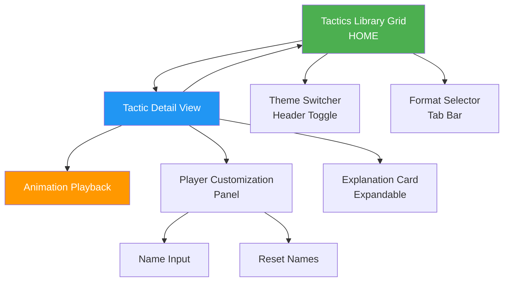

# Simple Tactics UI/UX Specification

**Version:** 1.0
**Date:** 2025-10-18
**Author:** Sally (UX Expert)
**Status:** Ready for Architecture Phase

---

## Introduction

This document defines the user experience goals, information architecture, user flows, and visual design specifications for **Simple Tactics'** user interface. It serves as the foundation for visual design and frontend development, ensuring a cohesive and user-centered experience.

**Document Purpose:**
This UI/UX specification translates the product requirements into detailed design guidance for creating an engaging, mobile-first Progressive Web App that empowers volunteer youth soccer coaches (ages 5-11) to explain tactical concepts with confidence and capture children's attention through age-appropriate visual themes.

**Scope:**
This specification covers the complete user experience for the MVP including the tactics library grid, tactic detail view with animations, dual-theme system (Superhero & Professional modes), format selection (5v5/7v7/9v9), player customization, and all supporting UI components.

### Change Log

| Date | Version | Description | Author |
|------|---------|-------------|--------|
| 2025-10-18 | 1.0 | Initial UI/UX specification created | Sally (UX Expert) |

---

## Overall UX Goals & Principles

### Target User Personas

**1. Time-Strapped Volunteer Coach (Primary)**
- Parents/guardians aged 30-50 volunteering for their kids' teams
- Limited to no formal coaching experience
- Mixed tech proficiency, highly sensitive to friction and complexity
- Need instant value in under 5 minutes
- Experience pre-game anxiety when explaining tactics

**2. Experienced Grassroots Coach (Secondary)**
- Age 25-60, former players or certified coaches (UEFA C, USSF D/E)
- Strong tactical knowledge but limited preparation time
- Seek time-saving tools and resources to share with volunteer assistants
- Value consistency and standardized tactical language

**3. Young Soccer Players (Indirect Users)**
- **Ages 5-7:** Short attention spans (20-30 seconds), respond to playful themes, superheroes, bright colors
- **Ages 9-11:** Longer attention, want to feel "serious" like professionals, TV broadcast aesthetics

### Usability Goals

1. **Zero Friction Access:** Coaches can select and view a tactic within 3 taps and 2 minutes, no login required
2. **Instant Comprehension:** Visual-first interface with static thumbnails enables tactics to be recognized at a glance
3. **Confidence Building:** Ready-made, expert-quality content makes coaches feel prepared and reduces anxiety
4. **Kid Engagement:** Animations and age-appropriate themes capture attention longer than verbal-only explanations
5. **Sideline Reliability:** Works offline after first load, high contrast for outdoor readability, large touch targets for distracted use

### Design Principles

1. **Translation Over Tools** - Provide the expert knowledge library (explanations, metaphors) that volunteers lack, not just drawing capabilities
2. **Visual Defaults, Never Blank Canvas** - Every screen shows beautiful, useful content immediately; no overwhelming empty states
3. **Dual Personality with Instant Switching** - Feel equally authentic as a "game" for 5-7 year-olds and a "serious tool" for 9-11 year-olds
4. **Mobile-First, Sideline-Optimized** - Bright visuals for outdoor glare, large touch targets for crowded screens, works in 30-second coaching windows
5. **Delight Through Motion** - Animated tactics make complex concepts comprehensible and create memorable "lightbulb" moments

---

## Information Architecture (IA)

### Site Map / Screen Inventory



### Navigation Structure

**Primary Navigation:**
- **Pattern:** Visual grid browsing with tap-to-detail paradigm (no traditional navigation menu)
- **Core Flow:** Grid → Detail → Back to Grid (linear, non-hierarchical)
- **No hamburger menu or complex navigation** - Simplicity is paramount for time-strapped users

**Secondary Navigation:**
- **Theme Switcher:** Persistent toggle in top header (visible on all screens)
  - Icon-based: 🦸 Superhero / 👔 Professional
  - Instant visual feedback on switch

- **Format Selector:** Tab bar below header
  - Options: 5v5 | 7v7 | 9v9
  - Default: 7v7 (most common format for ages 5-11)
  - Updates all tactics immediately

**Breadcrumb Strategy:**
- **None needed** - Only 2 levels deep (Grid → Detail)
- Back button on detail view clearly returns to grid
- Browser back button works (React Router handles history)

---

## User Flows

### Flow 1: First-Time User - View Tactic (Primary "3-Tap" Flow)

**User Goal:** A volunteer coach opens the app for the first time and wants to quickly view a tactic to show their team.

**Entry Points:** Direct URL or PWA home screen icon

**Success Criteria:** Coach successfully views an animated tactic within 2 minutes without assistance

#### Flow Steps

1. App opens → Tactics Library Grid loads (default: Superhero theme, 7v7 format)
2. Coach taps tactic card → Navigate to Detail View
3. Field auto-plays animation (or coach taps Play button)
4. Coach reads minimized explanation (1-liner visible at bottom)
5. Optional: Swipe up to expand full explanation
6. SUCCESS: Coach shows animation to team

**Edge Cases:**
- No network on first visit: Show error "Please connect to internet for first use"
- Animation stutters: Fallback to static diagram with arrows
- Coach taps wrong tactic: Back button always visible

---

### Flow 2: Switching Themes (Superhero ↔ Professional)

**User Goal:** Coach coaching different age groups wants to switch visual theme.

**Entry Points:** Any screen (Grid or Detail View)

**Success Criteria:** Theme switches instantly; preference persists across sessions

#### Flow Steps

1. Coach sees theme toggle in header (🦸 ⟷ 👔)
2. Coach taps toggle
3. Instant visual transformation (500ms animation):
   - Colors change
   - Player icons morph
   - Typography updates
   - Explanation text switches language
4. Preference saved to localStorage
5. If on Detail View with animation playing → Animation restarts in new theme

---

### Flow 3: Selecting Different Format (5v5, 7v7, 9v9)

**User Goal:** Coach needs to adapt tactics for their specific team format.

**Entry Points:** Grid or Detail View

**Success Criteria:** Format changes apply to all tactics; preference persists

#### Flow Steps

1. Coach sees format tab bar (5v5 | 7v7 | 9v9)
2. Coach taps desired format (e.g., 5v5)
3. Format updates globally
4. Preference saved to localStorage
5. If on Detail View → Field re-renders with new player count, animation restarts
6. If on Grid → Thumbnails update (instant, no animation needed)

---

### Flow 4: Customizing Player Names

**User Goal:** Coach wants to personalize tactics by assigning players' names.

**Entry Points:** Detail View only

**Success Criteria:** Names persist across tactics and sessions; visible during animation

#### Flow Steps

1. Coach on Detail View sees "Customize Names" button
2. Coach taps button → Customization panel opens
3. List of positions shown with text inputs
4. Coach taps position → Keyboard opens
5. Coach types name (e.g., "Sarah") → Auto-saves on blur
6. Repeat for other positions
7. Coach taps "Done" → Panel closes
8. Detail view shows field with custom names visible during animation

**Edge Cases:**
- Name too long (>15 chars): Truncate with ellipsis
- Format change (7v7 → 5v5): Positions 6-7 names hidden but preserved
- Reset confirmation: "Clear all names?" modal before deleting

---

### Flow 5: Offline Usage (Return Visit Without Network)

**User Goal:** Coach at soccer field with no cell signal opens previously used app.

**Entry Points:** PWA home screen icon

**Success Criteria:** App loads fully offline; all tactics accessible

#### Flow Steps

1. Coach opens app offline
2. Service Worker intercepts request
3. Load app from cache (all tactics, assets cached)
4. Read localStorage (theme, format, names)
5. Render Grid with all preferences
6. Full functionality available offline

**Edge Cases:**
- First visit offline: Show error "Connect to internet for first use"
- Cache corrupted: Show "Clear cache" button
- New tactics added online: User sees cached version until back online

---

### Flow 6: Viewing and Using Tactic Explanations

**User Goal:** Coach views a tactic and needs to understand HOW to explain it to their team.

**Entry Points:** Detail View (after selecting tactic)

**Success Criteria:** Coach reads explanation, has language/metaphors to use with kids

#### Flow Steps

1. Coach on Detail View sees three sections:
   - Animated field (top, 420px)
   - Minimized explanation bar (bottom, 40px with one-liner)
   - Animation controls (overlaid on field)
2. Explanation bar shows teaser: "💬 Rocket Racers sprint up fast!"
3. Coach swipes up on bar (or taps) → Explanation expands to 365px
4. Field shrinks to 182px (still visible, still animating)
5. Coach reads full explanation:
   - Kid-speak or Professional description (based on theme)
   - Character roles (Rocket Racers, Brick Walls, Busy Bees)
   - When to use tips
6. Optional: Coach taps "⇄ Switch to tactical language" to override theme default
7. Coach taps "Show My Team" button → Explanation minimizes, animation plays

**Key Design Decision:** Explanation below field (not floating/obstructing) ensures full tactical visibility

---

## Wireframes & Mockups

### Design Files

**Primary Design Files:** To be created in Figma

**Recommendation:** Create separate Figma files for:
- Superhero Theme designs
- Professional Theme designs
- Component library (shared across themes)
- Animation storyboards

---

### Screen 1: Tactics Library Grid (Home Screen)

**Purpose:** Primary landing screen where coaches browse and select pre-built tactics

**Layout (Mobile - 375px width):**

```
┌─────────────────────────────────────┐
│  Simple Tactics            🦸 ⟷ 👔  │  ← Header (60px)
├─────────────────────────────────────┤
│  [5v5]    [7v7]    [9v9]           │  ← Tab bar (48px)
│           (Default ▾)               │
├─────────────────────────────────────┤
│                                     │
│  ┌─────────┐ ┌─────────┐          │  ← Tactic cards (2-col)
│  │ HIGH    │ │ BUILD   │          │     165px × 200px each
│  │ PRESS   │ │ UP      │          │
│  │   ⬆️⬆️⬆️  │ │  ➡️🎯  │          │  ← Simplified icons
│  │  🟢🟢🟢  │ │ 🟢→🟢   │          │
│  │ Pressing│ │ Passing │          │  ← Category badge
│  └─────────┘ └─────────┘          │
│                                     │
│  [... 8-12 total cards...]          │  ← Scrollable
└─────────────────────────────────────┘
```

**Key Elements:**
- Header: App title + theme toggle (🦸 ⟷ 👔)
- Tab bar: Format selector with "Default" indicator under 7v7
- Tactic cards: Static thumbnails (not animated), category color badges
- 2-column grid on mobile, responsive to larger screens

---

### Screen 2: Tactic Detail View (Default State)

**Purpose:** Shows animated tactical diagram with non-obstructing explanation

**Layout (Mobile - 375px width, 667px height):**

```
┌─────────────────────────────────────┐
│  ← HIGH PRESS ATTACK       🦸 ⟷ 👔  │  ← Header (60px)
├─────────────────────────────────────┤
│                                     │
│         [ANIMATED FIELD]            │  ← Canvas (420px)
│                                     │     NO OBSTRUCTION
│    🟢  →  🟢                        │     Full tactical view
│         ⚽                          │
│    🔵  ←  🔵                        │     All positions visible
│         🔵                          │
│                                     │
│      ▶️   ⏸️   🔁                   │  ← Controls overlaid
│   (Semi-transparent)                │     on field
├─────────────────────────────────────┤
│  ═══ Swipe up for explanation ═══  │  ← Minimized bar (40px)
│  💬 Rocket Racers sprint up fast!  │     One-liner teaser
└─────────────────────────────────────┘     Drag handle (═══)
```

**Key Features:**
- Field gets full 420px (unobstructed by explanation)
- Animation controls overlaid on field (standard video player pattern)
- Minimized explanation bar (40px) with drag handle and teaser text
- Bounces on first visit to draw attention

---

### Screen 3: Tactic Detail View (Expanded Explanation)

**Purpose:** Shows full explanation with field still visible above

**Layout:**

```
┌─────────────────────────────────────┐
│  ← HIGH PRESS ATTACK       🦸 ⟷ 👔  │  ← Header (60px)
├─────────────────────────────────────┤
│    [ANIMATED FIELD - Minimized]    │  ← Field (182px)
│    🟢 → 🟢         🔵 ← 🔵         │     30% of viewport
│      ▶️   ⏸️   🔁                   │     Controls overlaid
├─────────────────────────────────────┤
│  ═══ Swipe down to minimize ═══    │  ← Drag handle
├─────────────────────────────────────┤
│  💬 HOW TO EXPLAIN:                 │  ← Explanation (365px)
│                                     │     60% of viewport
│  The Rocket Racers sprint up super  │     Scrollable
│  fast to get the ball! The Brick    │
│  Walls stay back to protect...     │
│                                     │
│  ⭐ CHARACTER ROLES:                │
│  ⚡ Rocket Racers (Forwards)        │
│  🧱 Brick Walls (Defenders)         │
│  🐝 Busy Bees (Midfielders)         │
│                                     │
│  💡 WHEN TO USE:                    │
│  • Your team is faster              │
│  • Small field                      │
│                                     │
│  ⇄ Switch to tactical language      │  ← Override link
├─────────────────────────────────────┤
│  [▶️ Show My Team]                  │  ← Primary CTA
│  [Customize Names]                  │  ← Secondary button
└─────────────────────────────────────┘
```

**Dynamic Heights:**
- Header: 60px (fixed)
- Field: 30% of remaining viewport
- Explanation: 60% of remaining viewport (scrollable)
- Buttons: 10% of remaining viewport

---

### Screen 4: Player Customization Panel

**Purpose:** Allows coaches to assign player names to positions

**Layout:**

```
┌─────────────────────────────────────┐
│  ← Customize Players       [Reset]  │  ← Header
├─────────────────────────────────────┤
│  Position 1: Forward                │  ← List view
│  [Sarah____________] ✏️ (5/15)     │     Character counter
│                                     │
│  Position 2: Midfielder             │
│  [Miguel___________] ✏️ (6/15)     │
│                                     │
│  Position 3: Defender               │
│  [Player 3_________] ✏️            │  ← Default placeholder
│                                     │
│  [... more positions based on       │
│   format: 5 for 5v5, 7 for 7v7]    │
│                                     │
│  🔒 HIDDEN IN 5v5:                  │  ← If format < 7v7
│  Position 6: [Emma] (Saved)        │     Names preserved
│  Position 7: [Lucas] (Saved)       │     but grayed out
├─────────────────────────────────────┤
│  [Clear All Names]  [Done]          │  ← Action buttons
└─────────────────────────────────────┘
```

**Features:**
- List-based (easier on small screens than field tapping)
- Inline text inputs with character counter (15 char limit)
- Shows position role labels (Forward, Defender, etc.)
- Hidden positions shown when format changes (names preserved)
- Reset requires confirmation modal

---

### Loading States

**Skeleton Screen (Initial Load):**

```
┌─────────────────────────────────────┐
│  Simple Tactics            🦸 ⟷ 👔  │
├─────────────────────────────────────┤
│  [5v5]    [7v7]    [9v9]           │
├─────────────────────────────────────┤
│  ┌─────────┐ ┌─────────┐          │  ← Gray placeholders
│  │░░░░░░░░░│ │░░░░░░░░░│          │     Shimmer animation
│  │░░░░░░░░░│ │░░░░░░░░░│          │     While loading
│  └─────────┘ └─────────┘          │
└─────────────────────────────────────┘
```

**Offline Indicator:**

```
│  Simple Tactics  ⚡Offline  🦸 ⟷ 👔 │  ← Badge in header
```

---

## Component Library / Design System

### Design System Approach

**Strategy:** Custom component library optimized for Simple Tactics with dual-theme support built-in.

**Rationale:** No existing design system (Material, Bootstrap) supports dramatic theme transformations (playful ↔ professional)

---

### Core Components

#### **TacticCard**

**Variants:** Default, Hover/Touch, Active/Pressed, Loading, Error

**Structure:** 165px × 200px card with icon (120×120px), title, category badge

**Theme Variations:**
- Superhero: Colorful border (3px gradient), bold shadow, rounded corners (12px)
- Professional: Gray border (1px), subtle shadow, sharp corners (6px)

---

#### **FieldCanvas**

**Variants:** Full-size (420px), Minimized (182px)

**States:** Loading, Ready, Playing, Paused, Error

**Theme Variations:**
- Superhero: Bright green (#32CD32), 4px field lines, character icons, motion trails
- Professional: Realistic green (#228B22), 2px field lines, numbered jerseys, clean movement

**Performance:** 30 FPS minimum, requestAnimationFrame, GPU-accelerated

---

#### **AnimationControls**

**Variants:** Play, Pause, Restart buttons (56×56px each)

**Theme Variations:**
- Superhero: Gradient backgrounds, glow effects, sparkles on interaction
- Professional: Solid dark gray, simple scale on hover

**Positioning:** Overlaid on field (semi-transparent background), centered horizontally

---

#### **ThemeToggle**

**Structure:** 88px × 44px toggle with 🦸 and 👔 icons

**Behavior:** Instant visual feedback, saves to localStorage, triggers 500ms theme transition

**Accessibility:** ARIA label, keyboard accessible (Tab + Enter/Space)

---

#### **FormatTabBar**

**Structure:** Three tabs (5v5, 7v7, 9v9), full width, 48px height

**Features:** Sliding underline animation (300ms), "Default ▾" indicator under 7v7

**Theme Variations:**
- Superhero: Purple active color, gradient underline, bounce easing
- Professional: Dark blue active, solid underline, linear easing

---

#### **ExplanationCard**

**Variants:** Minimized (40px), Expanded (365px)

**Structure:**
- Drag handle (═══)
- Explanation text (kid-speak or tactical)
- Character roles with icons
- When to use tips
- Language override link (optional)

**Interaction:** Swipe to expand/collapse, follows finger during drag

**Theme Variations:**
- Superhero: White background, dark text, kid-speak, colorful role icons
- Professional: Dark gray background (#2C2C2C), white text, tactical language

---

#### **Button**

**Variants:** Primary (filled), Secondary (outlined), Text-only

**States:** Default, Hover, Active, Disabled, Loading

**Theme Variations:**
- Superhero: Gradient backgrounds, 12px border-radius, bold shadows, glow on hover
- Professional: Solid colors, 6px border-radius, subtle shadows, simple scale

**Sizes:** Primary (48px height), Secondary (44px)

---

#### **TextInput**

**Use:** Player name customization

**Features:** 15 character limit, character counter, auto-capitalize, auto-save on blur

**States:** Default, Focused, Error, Disabled

**Theme Variations:**
- Superhero: 2px light blue border, rounded corners, playful placeholder
- Professional: 1px gray border, sharp corners, standard placeholder

---

## Branding & Style Guide

### Color Palette

#### Superhero Mode (Ages 5-7)

**Primary:**
- Hero Purple: #9C27B0
- Hero Blue: #2196F3
- Hero Orange: #FF9800

**Category Colors:**
- Pressing: #F44336 (red)
- Passing: #FFEB3B (yellow)
- Defending: #4CAF50 (green)
- Set Pieces: #9C27B0 (purple)

**Neutrals:**
- Dark Text: #212121
- Medium Gray: #757575
- Light Gray: #BDBDBD
- Background: #FAFAFA
- White: #FFFFFF

**Field:**
- Grass: #32CD32 (bright green)
- Lines: #FFFFFF (4px)

---

#### Professional Mode (Ages 9-11)

**Primary:**
- Pro Dark Blue: #1976D2
- Pro Navy: #0D47A1
- Pro Teal: #00897B

**Category Colors (Muted):**
- Pressing: #C62828 (dark red)
- Passing: #1565C0 (navy blue)
- Defending: #2E7D32 (forest green)
- Set Pieces: #6A1B9A (deep purple)

**Neutrals:**
- Dark Text: #212121
- Medium Gray: #616161
- Light Gray: #9E9E9E
- Background: #ECEFF1 (cool gray)
- Card White: #FFFFFF
- Dark BG: #2C2C2C (explanation card)

**Field:**
- Grass: #228B22 (realistic green)
- Lines: #FFFFFF (2px)

---

### Typography

#### Font Families

**Superhero Mode:**
- Primary: Fredoka (rounded, friendly sans-serif)
- Secondary: Nunito
- Fallback: 'Comic Sans MS', cursive, sans-serif

**Professional Mode:**
- Primary: Inter (clean, modern sans-serif)
- Secondary: SF Pro Display / Roboto
- Fallback: -apple-system, 'Segoe UI', sans-serif

---

#### Type Scale

| Element | Superhero | Professional |
|---------|-----------|--------------|
| H1 | 28px / Bold / Fredoka | 24px / Semibold / Inter |
| H2 | 24px / Bold / Fredoka | 20px / Semibold / Inter |
| H3 | 20px / Semibold / Nunito | 18px / Medium / Inter |
| Body | 18px / Regular / Nunito | 16px / Regular / Inter |
| Small | 16px / Regular / Nunito | 14px / Regular / Inter |
| Caption | 14px / Regular / Nunito | 12px / Regular / Inter |
| Button | 18px / Bold / Fredoka | 16px / Medium / Inter |

---

### Iconography

**Strategy:** Custom SVG icons (no external library)

**Player Icons:**
- Superhero: Character-based (⚡ Rocket Racer, 🧱 Brick Wall, 🐝 Busy Bee)
- Professional: Numbered jerseys, circular, realistic proportions

**UI Icons:**
- Superhero: Rounded, playful, 3px strokes, bright colors
- Professional: Sharp, minimal, 1.5px strokes, monochrome

**Sizes:** Small (16×16px), Medium (24×24px), Large (48×48px), Field Players (32×32px)

---

### Spacing & Layout

**Grid System:** 8px base unit (all spacing multiples of 8)

**Spacing Scale:**
- 4px (xs) - Tight spacing
- 8px (sm) - Compact spacing
- 16px (md) - Default spacing
- 24px (lg) - Comfortable spacing
- 32px (xl) - Large spacing
- 48px (xxl) - Extra large spacing

**Layout:**
- Mobile viewport minimum: 375px
- Horizontal padding: 16px
- Max content width: 1200px (desktop)

---

### Visual Effects

#### Shadows

**Superhero:**
- Card: 0 4px 8px rgba(156, 39, 176, 0.2) (purple tint)
- Button: 0 4px 12px rgba(33, 150, 243, 0.3) (blue tint)

**Professional:**
- Card: 0 2px 4px rgba(0, 0, 0, 0.1) (subtle gray)
- Button: 0 2px 6px rgba(25, 118, 210, 0.2) (blue tint)

---

#### Border Radius

**Superhero:** Small (8px), Medium (12px), Large (16px)

**Professional:** Small (4px), Medium (6px), Large (8px)

---

#### Transitions

**Timings:**
- Fast: 150ms (hover states)
- Normal: 300ms (expansions, format changes)
- Slow: 500ms (theme transformations)

**Easing:**
- Standard: cubic-bezier(0.4, 0.0, 0.2, 1)
- Bounce: cubic-bezier(0.68, -0.55, 0.265, 1.55) (Superhero only)

---

## Accessibility Requirements

### Compliance Target

**Standard:** WCAG 2.1 Level AA

---

### Key Requirements

**Visual:**
- Color contrast: 4.5:1 minimum for normal text, 3:1 for large text (18px+)
- Focus indicators: 2px solid outline, high contrast
- Text sizing: 16px minimum, supports zoom to 200%

**Interaction:**
- Keyboard navigation: All elements accessible via Tab, Enter, Space, Arrow keys
- Touch targets: 44×44px minimum (all buttons meet this)
- Screen reader support: ARIA labels, semantic HTML, logical heading structure

**Motion:**
- Respect `prefers-reduced-motion` media query
- Pause controls always accessible
- Disable animations when reduced motion detected

---

### Testing Strategy

**Automated:**
- Lighthouse CI (accessibility score ≥90)
- axe DevTools (0 violations)

**Manual:**
- Keyboard-only navigation
- Screen reader testing (VoiceOver, TalkBack)
- Color blindness simulation

---

## Responsiveness Strategy

### Breakpoints

| Breakpoint | Min | Max | Devices | Layout |
|------------|-----|-----|---------|--------|
| Mobile | 320px | 767px | Phones | 2-column grid, stacked |
| Tablet | 768px | 1023px | Tablets | 3-column grid, side-by-side |
| Desktop | 1024px | 1439px | Laptops | 4-column grid, max-width 1200px |
| Wide | 1440px+ | - | Monitors | Centered, max 1200px |

---

### Adaptation Patterns

**Layout:**
- Mobile: Single column detail view (field above explanation)
- Tablet Landscape: Side-by-side (field 60%, explanation 40%)
- Desktop: Max-width centered, generous whitespace

**Navigation:**
- All breakpoints: Same tab bar (simple interface, no change needed)

**Interaction:**
- Mobile: Touch gestures (swipe)
- Desktop: Mouse hover, keyboard shortcuts (Space = play/pause)

---

## Animation & Micro-interactions

### Motion Principles

**Superhero Mode:**
- Playful & energetic (bounce easing, overshoot effects)
- Attention-grabbing (bright colors, exaggerated movements)
- Kid-friendly timing (slightly slower for processing)

**Professional Mode:**
- Smooth & realistic (linear or ease-out, no overshoot)
- Subtle (clean transitions, no distracting effects)
- Broadcast quality (timing matches sports TV graphics)

---

### Key Animations

**1. Tactical Player Movement**
- Duration: 6 seconds (configurable)
- Easing: Ease-in-out
- Superhero: Motion trails, sparkles on key moments
- Professional: Clean movement only

**2. Theme Switch Transformation**
- Duration: 500ms
- Sequence: Colors crossfade (300ms) → Icons morph (400ms) → Typography adjusts (200ms)

**3. Explanation Card Expand/Collapse**
- Duration: 300ms
- Field and card animate simultaneously (choreographed)
- Content fades in during expansion

**4. Button Hover/Tap**
- Duration: 150ms
- Superhero: Scale 1.1x, glow, slight rotation
- Professional: Scale 1.05x, subtle shadow

**5. Format Selection Underline Slide**
- Duration: 300ms
- Underline width and position transition smoothly

**6. Card Loading Shimmer**
- Duration: 1.5s loop
- Gradient moves left to right

**7. Bounce Attention (First Visit)**
- Duration: 800ms (plays once)
- Explanation bar bounces up 20px, settles back

---

### Performance Constraints

- Frame rate: 30 FPS minimum
- GPU acceleration: Use `transform` and `opacity` (not `top`/`left`/`width`)
- Reduced motion: Respect `prefers-reduced-motion`, disable non-essential animations

---

## Next Steps

### Immediate Actions

1. Review this specification with stakeholders/development team
2. Create visual designs in Figma based on wireframes and brand guidelines
3. Export design assets (SVG icons, player graphics, field textures)
4. Prepare for handoff to Design Architect for frontend architecture

### Design Handoff Checklist

- ✅ All user flows documented
- ✅ Component inventory complete
- ✅ Accessibility requirements defined
- ✅ Responsive strategy clear
- ✅ Brand guidelines incorporated (dual themes)
- ✅ Performance goals established
- ✅ Animation specifications detailed

### For Architecture Phase

The Design Architect should now have sufficient detail to:
- Design data schema for tactics JSON (including animation keyframes)
- Validate technical feasibility of dual-theme system
- Prototype canvas animation performance
- Confirm bundle size targets (<2MB) are achievable
- Design component structure in React

---

**END OF UI/UX SPECIFICATION**
